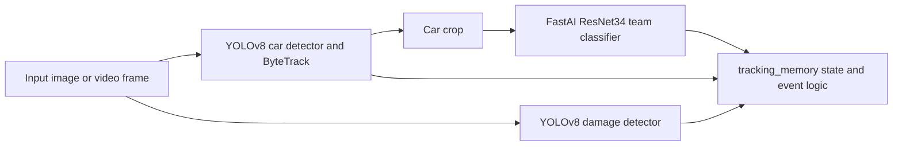
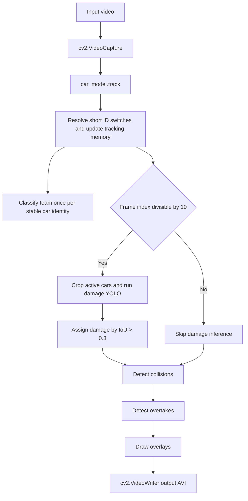

# AI Systems & Pipeline Reconstruction

This document maps the current computer vision stack to the code and model files in the repository.

## AI/LLM/RAG Presence Verification

* **Large Language Models:** Not present in the codebase.
* **Vector Databases / Embeddings:** Not present in the active app.
* **RAG / Prompting Systems:** Not present in the active app.

## Computer Vision Inference Stack

The application combines YOLOv8 detection/tracking, a YOLO damage detector, and a FastAI ResNet34 team classifier.

## YOLOv8 Car Detector and Tracker

* **Framework:** Ultralytics YOLOv8 / PyTorch.
* **Runtime Weight Path:** `models/best_f1_detect.pt`, configured by `app.config.CAR_MODEL_PATH`.
* **Integrity control:** Its SHA-256 is pinned and verified before Ultralytics loads it.
* **Dataset Config:** `data.yaml`.
* **Class Labels:** `['f1_car']`.
* **Confidence Threshold:** `CONF_TH = 0.4`.
* **Tracker Config:** `tracker/bytetrack.yaml`, configured by `app.config.TRACKER_CONFIG_PATH`.

## YOLOv8 Damage Detector

* **Framework:** Ultralytics YOLOv8 / PyTorch.
* **Runtime Path in Code:** `models/best_carDD.pt`, configured by `app.config.DAMAGE_MODEL_PATH`.
* **Integrity control:** Its SHA-256 is pinned and verified before Ultralytics loads it.
* **Image Endpoint Threshold:** `BASE_CONF = 0.45` in `src/detection.py`.
* **Video Pipeline Threshold:** `DAMAGE_CONF_TH = 0.4` in `src/pipeline.py`.
* **Damage Classes Used by Logic:** `tire_flat`, `glass_shatter`, `dent`, `scratch`, plus derived `glass_missing` from geometry heuristics.

Damage post-processing rules in `src/detection.py`:

* Ignore boxes with height below 3% of image height.
* Keep `tire_flat` only when centered in the lower 25% of the image; very large tire boxes become `glass_shatter`.
* Convert large upper-frame `glass_shatter` regions to `glass_missing`.
* Convert low-confidence or low-position `glass_shatter` detections to `scratch`.
* Convert aggregate glass area over 18% of the image to global `glass_missing`.

## FastAI Team Classifier

* **Framework:** FastAI with a ResNet34 backbone.
* **Runtime Model Path:** `models/f1_team_classifier.pkl`.
* **Integrity Control:** `app.config.verify_model_integrity()` checks the model SHA-256 before `load_learner()` runs.
* **Pinned SHA-256:** `d6594c0c1d5c7804ed65e20ce228eb07dbdf6b2829a244105d08577a53b244af`.
* **Inference Threshold:** `TEAM_CONF_TH = 0.6`; lower-confidence predictions become `"UNKNOWN"`.
* **Training command:** `src/classification.py --dataset-dir <team-folder>` exports atomically to the runtime model path by default. It prints the required new SHA-256, which must be reviewed and pinned in `app/config.py` before deployment.

## Video Processing Pipeline Trace

## Event Logic

| Event | Current Logic |
| ----- | ------------- |
| Collision | A probable impact requires strong recent *smoothed* deceleration, adequate pre-impact speed, and a damage class confirmed on two inference frames. The lookback window bridges the damage-inference stride. |
| Overtake | Currently, visible active cars are sorted by `path_length`; rank improvement after cooldown creates a heuristic event. It is not a telemetry-grade position estimate. |
| Damage Severity | `LOW` through 10 elapsed video frames, `MEDIUM` through 30, `HIGH` beyond 30. |

## Current Runtime Notes

* `src/pipeline.py` checks that the car model, damage model, team model, and tracker config exist before loading models.
* Pipeline outputs are requested as `.mp4`; OpenCV writes an intermediate, then ffmpeg publishes a browser-compatible H.264/AAC MP4 with fast-start metadata.
* New raw ByteTrack IDs are only re-associated when motion, overlap, and scale agree unambiguously within a short gap. The summary exposes `track_reassociations` for inspection.

## Phase 4 Benchmark Harness

The benchmark harness lives under `benchmarks/`:

* `benchmarks/manifest.json` references existing image/video samples without duplicating data.
* `benchmarks/run_benchmarks.py` runs the current runtime models against those samples.
* `benchmarks/benchmark_results.md` is the human-readable output.
* `benchmarks/results/benchmark_results.json` is the machine-readable output.

Current evidence boundary:

* Team labels are available for selected image samples through dataset filenames.
* Car box labels are not available in the manifest, so car detection counts are measured but not scored.
* Damage labels are not available in the manifest, so damage detections are measured but not scored.
* Video track/event labels are not available, so tracked cars, collisions, overtakes, and damage counts are qualitative pipeline observations.
