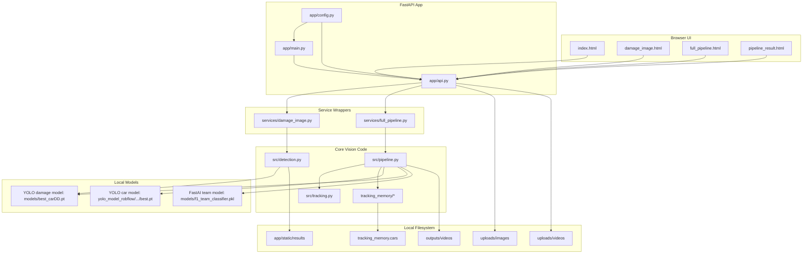
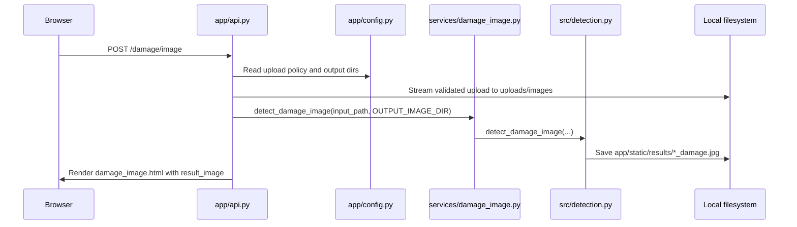
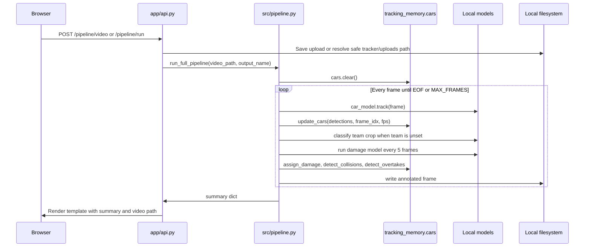
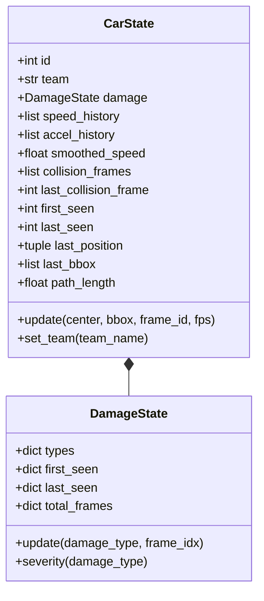

# System Architecture Reconstruction

This document maps the current application structure to the active source files.

## High-Level System Architecture

The app is a monolithic FastAPI service that runs local computer vision inference and stores inputs/results on disk.

## Request Flow

### Image Damage Flow

### Video Pipeline Flow

## State and Tracking Memory Relationships

## External Services and Queues

* **External APIs:** None verified in the active app.
* **Queues/Workers:** None. Video processing is synchronous inside the request path.
* **Database:** None. Runtime state is in memory and persistent artifacts are files.
* **Authentication:** None.
