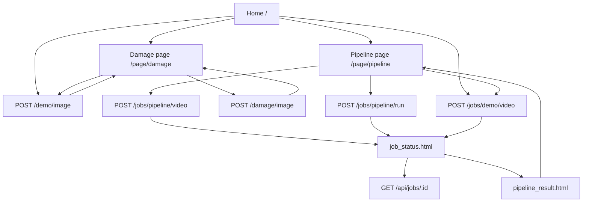

# Frontend UI Reconstruction

The frontend is a set of four Jinja2 templates in `app/templates/`. The UI is served directly by FastAPI and posts forms back to the same backend.

## Design System and Theme

Observed from the templates:

* **Fonts:** Orbitron for display headings; Rajdhani or Inter for body and controls.
* **Primary Colors:** F1 red `#e10600`, cyan/neon accents, black/carbon backgrounds.
* **Layout Style:** HUD-inspired panels, slanted buttons, telemetry-style labels, and dark racing-control visuals.
* **External Asset Dependency:** Templates load Google Fonts from `fonts.googleapis.com`.

## User Journey

## Page Audits

### `index.html`

* Home launcher for the two tools.
* Links to `/page/damage` and `/page/pipeline`.
* Includes quick demo buttons for the configured sample image and queued sample video job.
* Displays a static "LIVE TELEMETRY STREAM ACTIVE" label; it is visual text, not a backend health probe.

### `damage_image.html`

* Upload form posts to `/damage/image`.
* File input uses `accept="image/*"` and `required`.
* Backend enforces the real image policy: `.jpg`, `.jpeg`, `.png`, `.bmp`, max 20 MB.
* If `result_image` is provided, the template displays the annotated output image.
* Includes a sample-image form that posts to `/demo/image`.
* Result state includes a source label and a download link for the annotated image.
* If backend validation or inference fails, the page displays a red error panel with the failure message.

### `full_pipeline.html`

* Upload form posts to `/jobs/pipeline/video`.
* File input uses `accept="video/*"` and `required`.
* Backend enforces the real video policy: `.mp4`, `.avi`, `.mov`, `.mkv`, max 500 MB.
* Local-path form posts to `/jobs/pipeline/run`.
* The text input defaults to `tracker/tracker2.mp4`, which is allowed by the backend's safe local-video roots.
* Includes a sample-video form that posts to `/jobs/demo/video`.
* When `video_path` is passed by the backend, the page displays a `<video>` player, a summary log block, and a download link.
* If backend validation or inference fails, the page displays a red error panel instead of a raw server error.

### `job_status.html`

* Displays queued, running, completed, and failed states.
* Polls `/api/jobs/{job_id}` from the browser.
* Shows frame progress, status message, source label, duplicate-source marker, and friendly errors.
* Reveals a debrief link after the job reaches `completed`.

### `pipeline_result.html`

* Displays `summary.cars_tracked`, `summary.total_collisions`, `summary.total_overtakes`, and `summary.frames_processed`.
* Displays `summary.damage_type_counts` when damage is assigned to tracked cars.
* Has a replay video element.
* Includes source/output labels and open/download output links.
* Uses the web-safe `video_path` passed by `app/api.py`.

## Frontend Validation

The templates use native browser validation (`required`, `accept="image/*"`, and `accept="video/*"`). The authoritative validation is in the backend:

* `app/api.py::_save_validated_upload()`
* `app/config.py` upload constants
* `app/api.py::_resolve_safe_upload_path()`

Browser-side validation is helpful for UX but should not be treated as security control.
